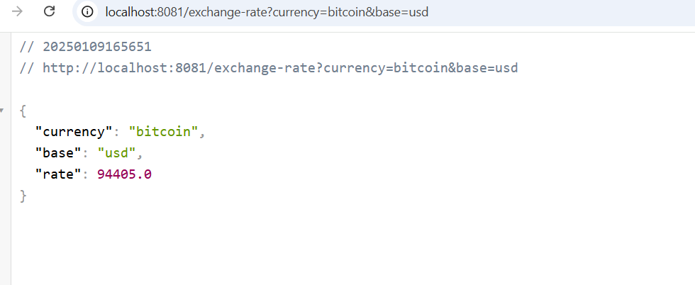
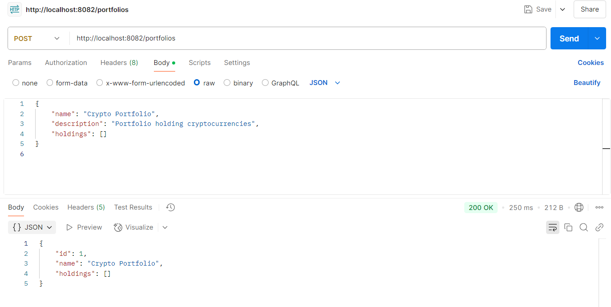
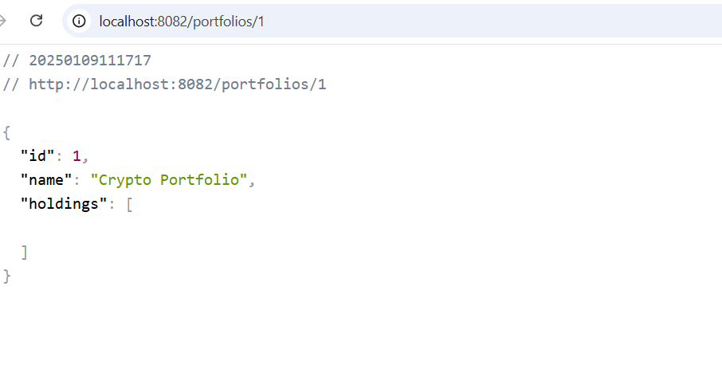
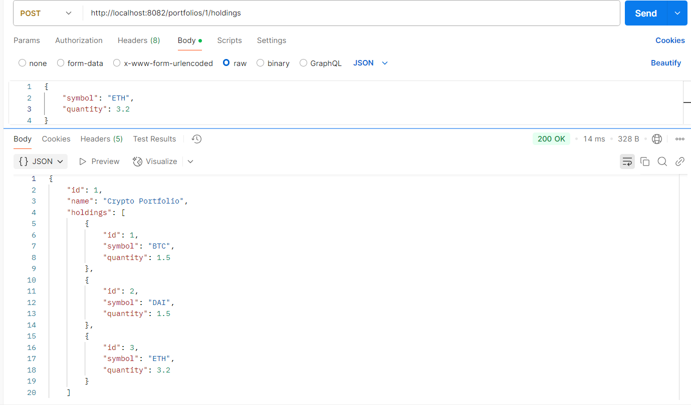
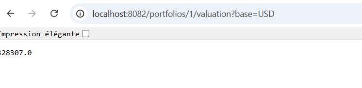
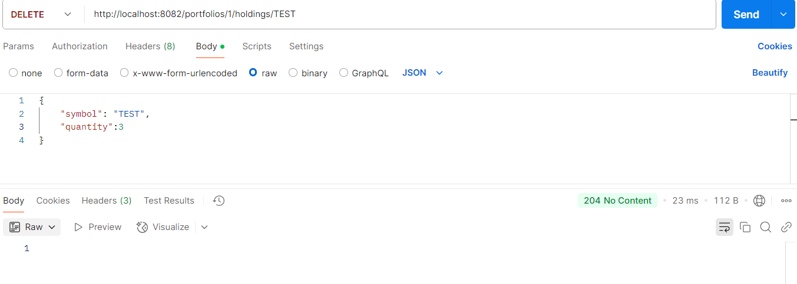

## ExchangeRateService

Port: 8081

Pour l'endpoint de ce projet GET /exchange-rate?symbol={symbol}&base={base}, vous pouvez tester avec un exemple comme:

http://localhost:8081/exchange-rate?currency=bitcoin&base=usd (GET)
résultat:

   ## Problème rencontré:
   Malgré que j'ai configuré CORS pour être consommé par l'application PortfolioService, pour ne pas y passer beaucoup de temps j'ai opté pour une solution alternative.
## PortfolioService

Port: 8082

J'ai créé dans le dossier main les entités Holding, et Portfolio qui sont liées via une relation ManytoOne et OnetoMany respectivement. En plus j'ai utilisé le JpaRepository pour gérer le CRUD.

PortfolioService regroupe les fonctions utilisées par les Endpoints.

http://localhost:8082/portfolios (POST)

http://localhost:8082/portfolios/1 (GET)

http://localhost:8082/portfolios/1/holdings (POST)

http://localhost:8082/portfolios/1/valuation?base=usd (GET)

//ici j'ai ajouté une crypto que j'ai nommée "TEST"
http://localhost:8082/portfolios/1/holdings/TEST (DELETE)

Faute de temps, j'avais créé les tests mais j'avais trouvé que j'allais oerdre plus de temps pour les regler en + du soucis de connexion entre localhost:8081 et localhost:8082 malgré la configuration du CORS, j'ai utilisé directement l'api du site https://api.coingecko.com/api/v3/simple/price 